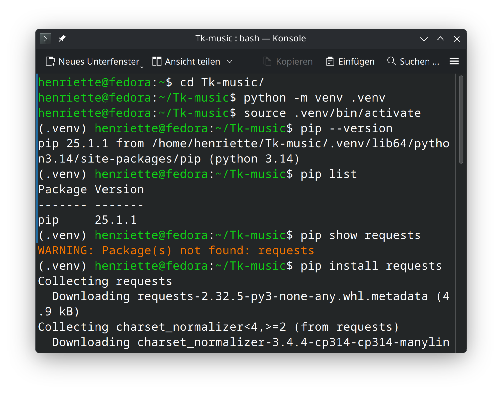
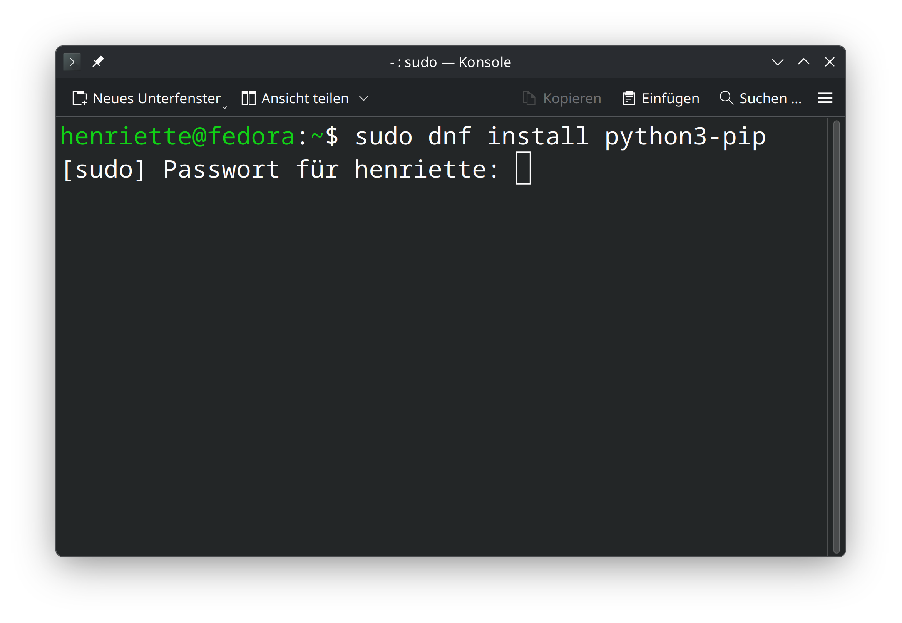
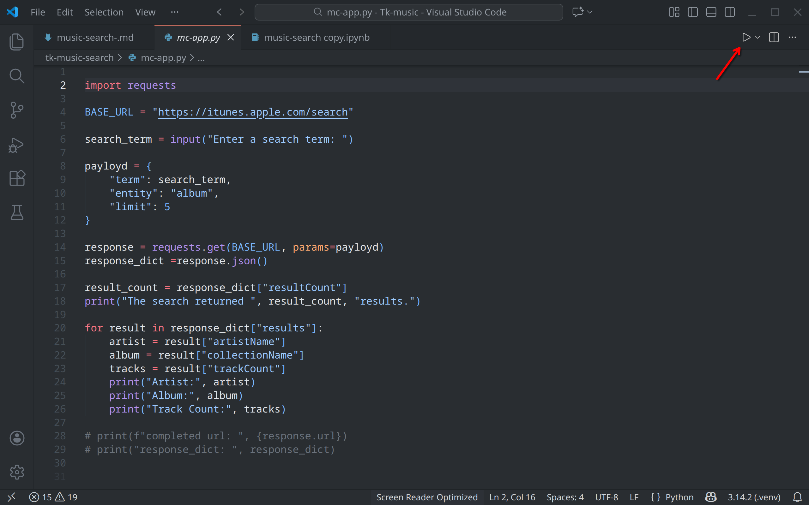
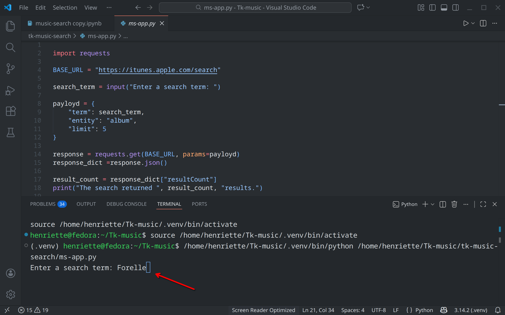
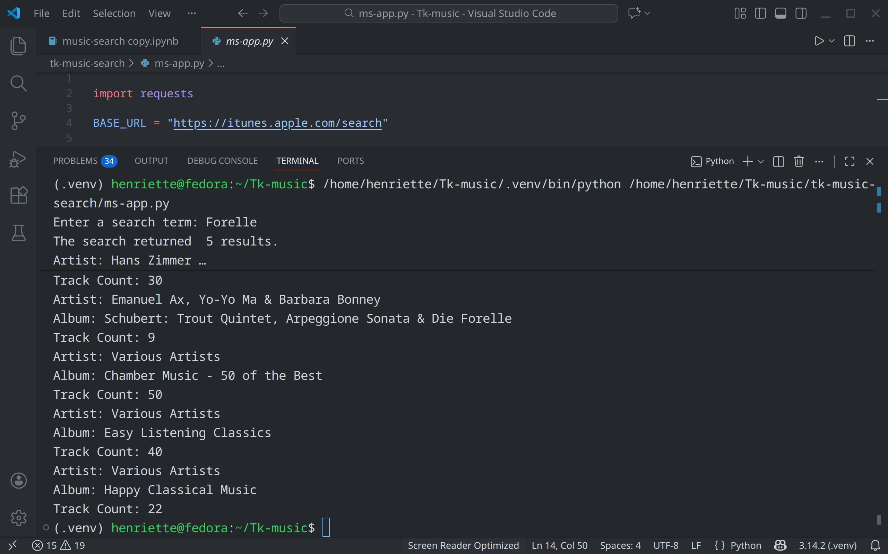
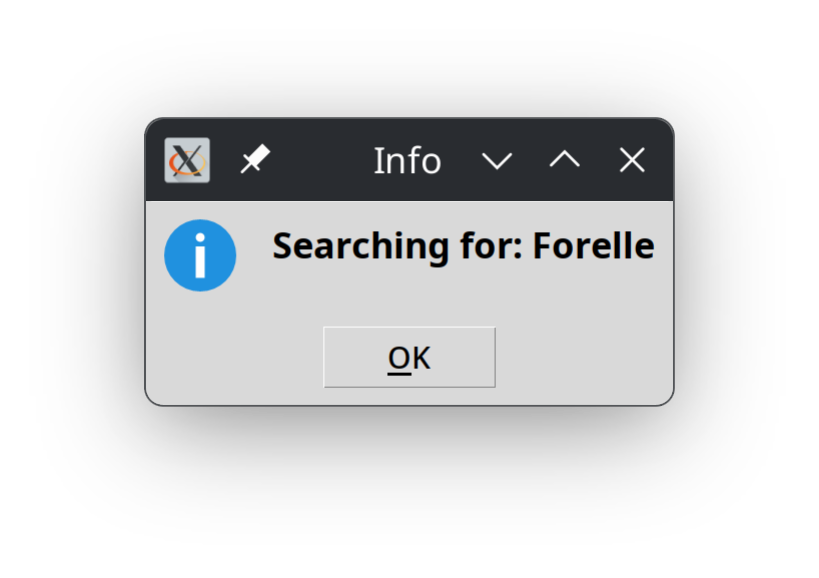

# Music Search mit Python und Tkinter - Teil 1


Wir stellen Ihnen ein kurzes Python-Programm vor, mit dem Sie ausprobieren können, wie man

- vom Benutzer einen Suchbegriff abfragt und speichert,
- dem Suchbegriff für eine Abfrage der Datenbank von Apple-iTunes einsetzt,
- dazu die erfoderliche API (Application Programming Interfade) einbindet
- das vom Server zurückgelieferte Ergebnis interpretiert und in ein für Python lesbares Format umwandelt
- das Ergebnis in Textform in einem Terminal ausgibt
- dazu eine grafische Benutzeroberfläche mit Tkinter erstellt

Ziel dieses ersten Teils ist es, die grundlegende Programmlogik für eine Musik-Suche mit Python zu entwickeln und diese anschließend in eine sehr einfache grafische Benutzeroberfläche mit Tkinter zu überführen.
Der Fokus liegt bewusst auf Verständlichkeit und Nachvollziehbarkeit, nicht auf Vollständigkeit oder UI-Optimierung.

Den Programmcode sowie ein Jupyter-Notebook mit Dokumentation haben wir auf GitHub bereitgestellt:

<link>
Für den Beitrag wird eine aktuelle Python-Installation mit virtuellem Environment verwendet. Eine ausführliche Anleitung zur Einrichtung einer virtuellen Umgebung auf verschiedenen Betriebssystemen finden Sie hier: 
<Link>

## Die Basis, das Python-Skript

Im ersten Abschnitt erstellen Sie das Python-Skript das nur die Funktionalität berietstellt, ohne GUI (Graphical User Interface). Dazu richten Sie auf Ihrem Rechner ein Projekt-Verzeichnis ein, z.B. `music-search`. Um den Programmcode vom der globalen Python-Installation zu separieren, richten Sie innerhalb des Projektordners eine Virtulle Umgegung ein. Öffnen Sie dazu ein Terminal und wechseln Sie in Ihr Projektverzeichnis:

```bash
cd music-search
# Venv einrichten:
python -m venv .venv
# Venv aktivieren:
source .venv/bin/activate
```


Eine ausführliche Anleitung, auch für andere Betriebssysteme finden Sie hier:

https://computer-und-sehen.de/python3-virtual-environment/

___

Innerhalb der eben angelegten `venv` installieren nun das Modul `requests` mit dem Befehl:

```bash
pip install requests
```



Erhalten Sie hier eine Fehlermeldung, installieren Sie zunächst `pip` auf dem Betriebssystem.  Öffnen Sie ein neues Terminal-Fenster, dort sollten Sie sich dann in Ihrem Home-Verzeichnis befinden und geben Sie den nachstehenden Befehl ein:

```bash
sudo dnf install python3-pip
```



Öffnen Sie Ihr Projekt-Verzeichnis anschließend in VSCode und erstellen Sie eine Skript-Datei, z.B. mit dem Namen `app` und der Dateiendung `.py`.

Den Inhalt unseres Skripts können Sie einfach in die Datei kopieren. Besser ist es, zur Übung den Code selbst zu schreiben.

```python
import requestsdann

BASE_URL = "https://itunes.apple.com/search"

search_term = input("Enter a search term: ")

payloyd = {
    "term": search_term,
    "entity": "album",
    "limit": 5
}

response = requests.get(BASE_URL, params=payloyd)
response_dict =response.json()

result_count = response_dict["resultCount"]
print("The search returned ", result_count, "results.")

for result in response_dict["results"]:
    artist = result["artistName"]
    album = result["collectionName"]
    tracks = result["trackCount"]
    print("Artist:", artist)
    print("Album:", album)
    print("Track Count:", tracks)
    
# print(f"completed url: ", {response.url})
# print("response_dict: ", response_dict)

```

Die letzten beiden Zeilen dienen nur zum Testen und sind daher auskommentiert. Der erste pirnt-Befehl zeigt die vollständige URL mit den angehängten Suchparametern. Die zweite das Python-Dictionary, das aus der Rückgabe vom Server generiert wird.

Die vollständige Dokumentation des Skripts finden Sie in dem Jupyter-Notebook.

Speichern Sie die Datei und starten Sie das Programm über die dreieckige Schaltfläche oben links.



Im unteren Bereich des Programmfensters öffnet sich dann das integrierte Terminal mit der Abfrage für die Benutzereingabe. Geben Sie hier einen beliebigen Suchbegriff ein und bestätigen mit der Eingabetaste.



Hat alles funktioniert, werden die ersten fünf Ergebnisse Ihrer Suche im Terminal angezeigt. Die Anzahl der ausgegebenen Ergebnisse richtet sich nach dem im Skript festgelegten Limit (` limit = 5`). Probieren Sie andere Werte aus.




## Grafische Benutzeroberfläche 

Tkinter ist das Standard-Python-Modul zur Erstellung grafischer Benutzeroberflächen (GUIs), Es dient als Schnittstelle zum plattformunabhängigen Tk-Toolkit und wird mit Python ausgeliefert. Sie können daher das Modul meist direkt nutzen.  Je nach Betriebssystem bzw. Python-Installation kann es aber zu der nachstehenden Fehlermeldung kommen:

```bash
ImportError: No module named Tkinter
```

Dann installieren Sie es selbst  (innerhalb der `venv`) mit dem Befehl:

```bash
pip install python3-tk
```

Anschließend können Sie die Funktionen von Tkinter in Ihrem Skript nutzen.

Erstellen Sie in Ihrem Projektverzeichnis für das neue Programm eine separate Datei, z.B. `music-search-gui.py` und fügen Sie den nachstehenden Code ein:

```py
import tkinter as tk
from tkinter import ttk
from tkinter.messagebox import showinfo
import requests

class App(tk.Tk):
    def __init__(self):
        super().__init__()

        self.title("Tk-MusicSearch")
        self.geometry("1200x800")

        self.app_heading = ttk.Label(
            self,
            text="Search for music terms",
            font=("Ubuntu", 30)
        )
        self.app_heading.pack(pady=20)

        self.result_frame = ResultFrame(self)
        self.search_frame = SearchFrame(self, self.result_frame)


class SearchFrame(ttk.Frame):
    """Input and search-button"""

    def __init__(self, master, result_frame):
        super().__init__(master)
        self.result_frame = result_frame
        
        self.search_term = tk.StringVar()

        search_entry = ttk.Entry(
            self,
            textvariable=self.search_term,
            width=20,
            font=("Carlito", 20)
        )
        search_entry.pack(pady=20)

        search_btn = ttk.Button(
            self, 
            text="Search",
            command=self.search
        )
        search_btn.pack(pady=20)

        self.search_term_lbl = ttk.Label(self, textvariable=self.search_term)
        self.search_term_lbl.pack(pady=20)

        self.pack(pady=20)

    def search(self):
        term = self.search_term.get().strip()
        if not term:
            showinfo("Info", "Bitte einen Suchbegriff eingeben")
            return
            
        self.result_frame.perform_search(term)


class ResultFrame(ttk.Frame):
    """Show API-results"""

    def __init__(self, master):
        super().__init__(master)

        self.result_lbl = ttk.Label(
            self, 
            text=("Results com here..."),
            justify="left",
            font=("Carlito", 14)
        )
        self.result_lbl.pack(pady=20)
        self.pack(pady=20)

    def perform_search(self, term):
        showinfo(title="Info", message=(f"Searching for: {term}"))

        BASE_URL = "https://itunes.apple.com/search"

        payloyd = {
            "term": term,
            "entity": "album",
            "limit": 5
            }

        try:
            response = requests.get(BASE_URL, params=payloyd, timeout=10)
            response.raise_for_status()
            data = response.json()
        except Exception as exc:
            self.result_lbl.config(text=("Error on request:\n{exc}"))
            return
        
        if data.get("resultCount", 0) == 0:
            self.result_lbl.config(text="No results found.")
            return

        result_count = data["resultCount"]

        output_lst  = []
        output_lst.append(f'Resuls found for term "{term}": {result_count}\n')

        for result in data["results"]:
            artist = result["artistName"]
            album = result["collectionName"]
            tracks = result["trackCount"]

            output_lst.append(f"{artist} – {album} (Tracks: {tracks})")

        output_text = "\n".join(output_lst) #if output_lst else "Keine Ergebnisse gefunden."         
        
        self.result_lbl.configure(text=output_text)
            

if __name__ == "__main__":
    app = App()
    app.mainloop()

```

Für die GUI, also das Programmfenster und die Widgets verwenden wir die objektorientierte Programmierung von Tkinter. D.h. es wird ein Fenster-Objekt erstellt, dem dann weitere Objekte hinzugefügt werden: 

- das Label für die Anzeige der Suchergebnisse
- ein Eingabefeld
- ein Button
- und nochmals ein Label, das den eingegebenen Suchbegriff wiederholt.

Starten Sie das Programm wie oben beschrieben. Es sollte sich dann unmittelbar ein Fenster öffnen. Nach der Eingabe eines Suchbegriffs klicken Sie auf den Search-Button.


Der eingegebene Suchbegriff wird als Label im unteren Fensterbereich angezeigt. Die Ergebnisse oberhalb des Eingabefeldes. Nach dem Klick auf den Button informiert eine Message-Box über den Start der Suche. 



Nach einem Klick auf OK sehen Sie die Suchergebnisse im Hauptfenster. Das Fenster lässt sich mit der Maus am Rand greifen und größer ziehen.


## Ausblick

Funktioniert Ihr Programm in dieser Basisversion, ist der nächste Schritt, weitere Funktionen hinzuzufügen und die Benutzeroberfläche netter zu gestalten. 
Die hier vorgestellte GUI ist bewusst einfach gehalten. Sie dient als funktionale Grundlage, auf der in Teil 2  Verbesserungen in Bezug auf Layout, Bedienbarkeit, Skalierung und Zugänglichkeit aufgebaut werden.

Bereits in dieser frühen Version wird darauf geachtet, ausschließlich native Tkinter-Widgets zu verwenden. Diese bilden eine wichtige Grundlage für Tastaturbedienung, Skalierbarkeit und eine mögliche Nutzung mit Screenreadern.


