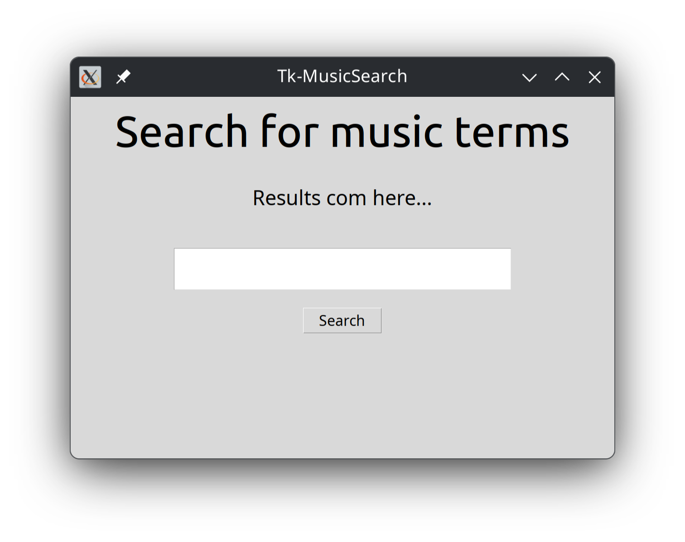
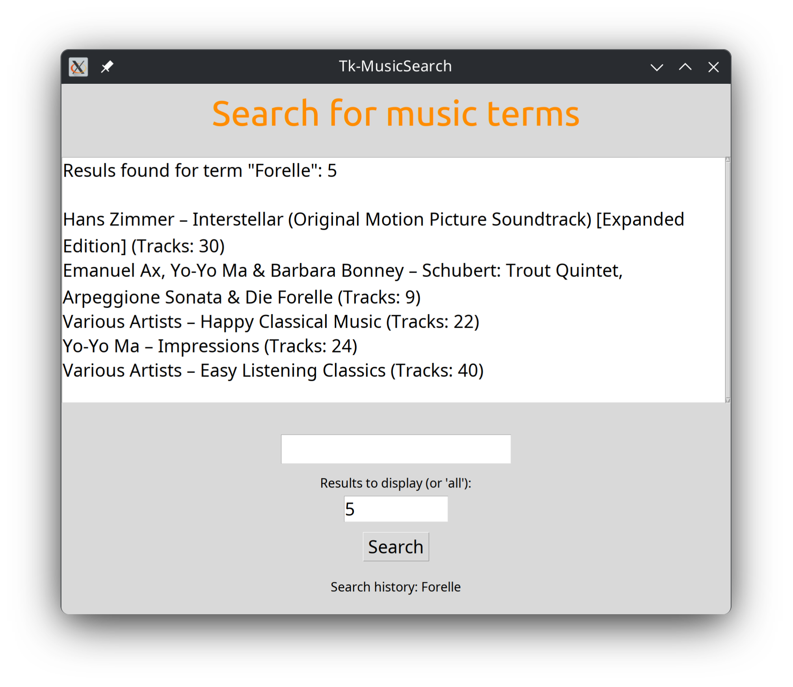
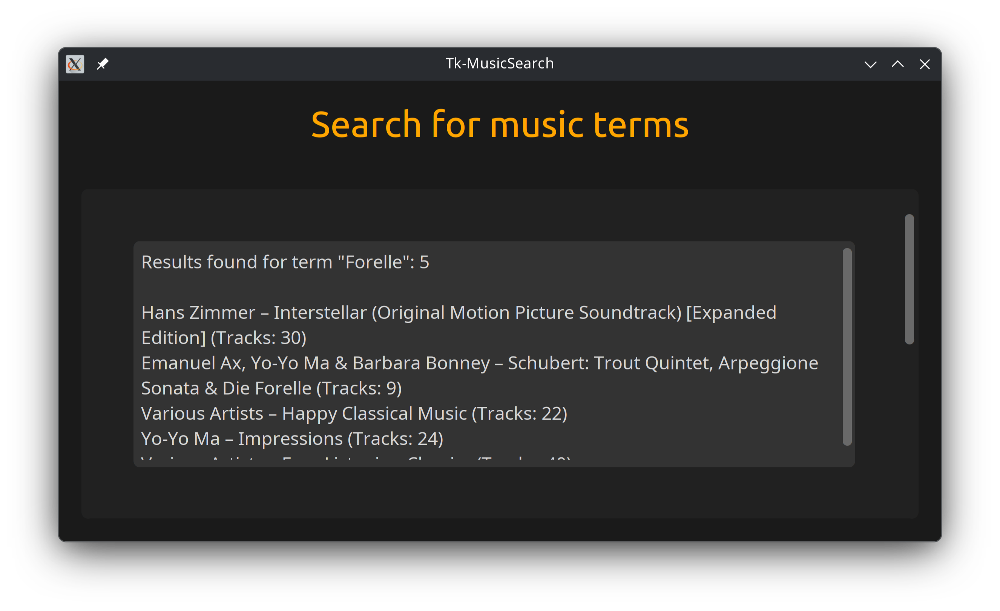
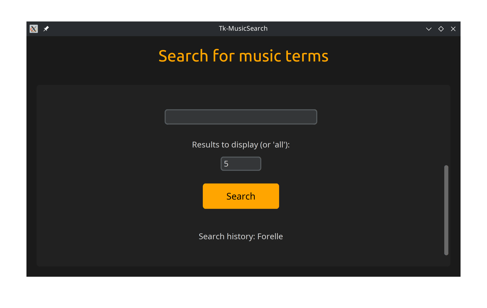
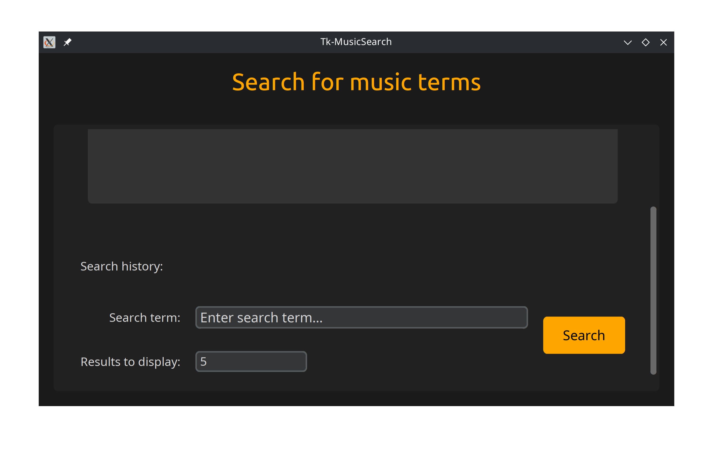
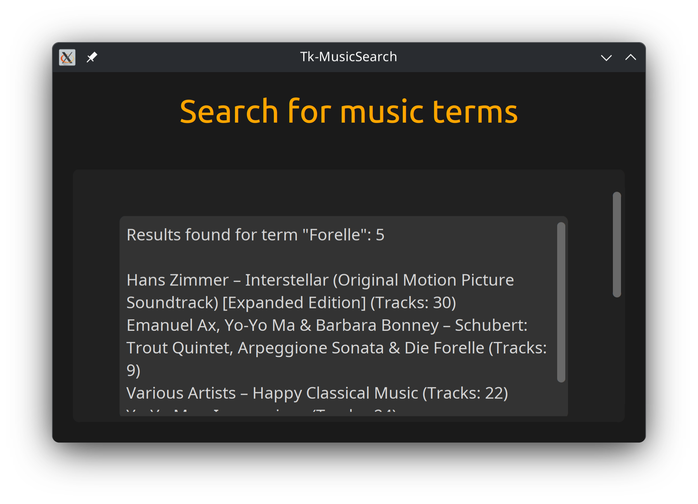
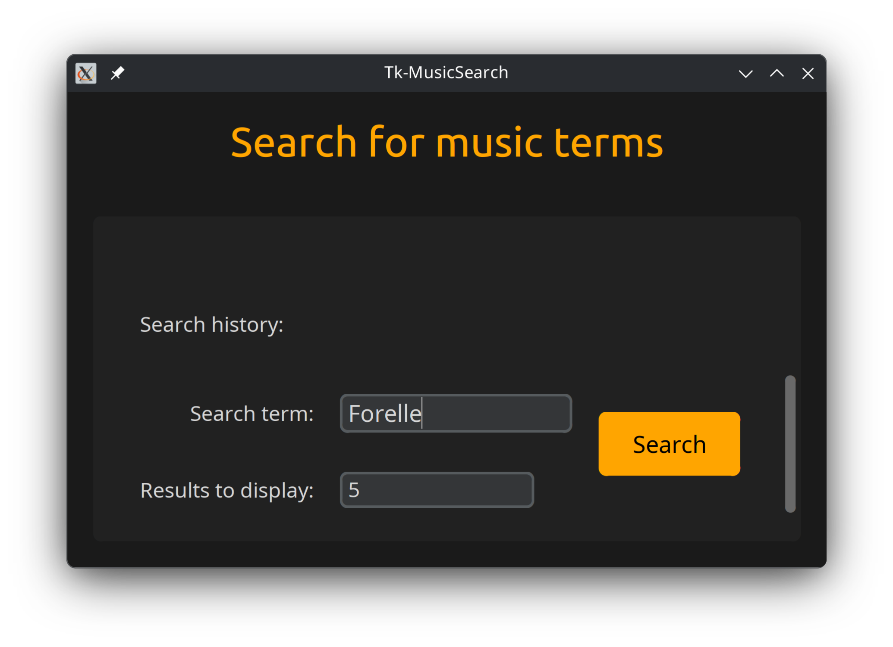

# MusicSearch mit Python und Tkinter - Teil 2

Im vorausgehenden Beitrag haben wir gezeigt, wie die App zunächst mit  grundlegender Funktionalität umgesetzt und anschließend um eine  Benutzeroberfläche mit Tkinter erweitert wurde.

Dieser zweite Teil des Beitrags gibt Anregungen zur Gestaltung der Benutzeroberfläche und Anpassung der Programmlogik.

Alle Dateien zum Projekt finden Sie auf [GitHub](https://github.com/henrietteBaum/MusicSearch-v1.git).

## Version 1.0

Version 1.0 stellt eine funktionale Kommandozeilen-Basis dar, die den Zugriff auf die iTunes-Search-API demonstriert.
Der Fokus liegt auf dem Verständnis des API-Aufbaus und der Datenstruktur, nicht auf Robustheit oder Modularität.
Fehlerbehandlung und strukturelle Trennung wurden bewusst zugunsten von Übersichtlichkeit zurückgestellt.

## Version 1.1

Version 1.1 erweitert Version 1.0 um eine grundlegende Benutzeroberfläche (GUI) mit Tkinter. Sie entspricht weitestgehend den Standard-Vorgaben von Tkinter. Wir verwenden hier aber bereits zwei Frames, einen für die Elemente der Suchlogik und einen für die Ausgabe der Suchergebnisse. Angepasst sind lediglich Schriftart und Größe.

Ziel ist nicht die vollständige UI-Optimierung, sondern die Einführung  von Frame-Strukturen, Ereignissteuerung und der Kopplung von  Benutzerinteraktion mit API-Anfragen.



Die Suchergebnisse werden erst einmal in einem Label dargestellt, um den Einstieg in Tkinter zu vereinfachen. Einschränkungen hinsichtlich Länge und Interaktion werden in späteren Versionen durch  geeignete Widgets (z. B. ScrolledText) adressiert.

## Version 1.2

In Version 1.2 kommen sowohl klassische tk-Widgets als auch ttk-Widgets  zum Einsatz. ttk-Widgets bieten ein moderneres, plattformnahes  Erscheinungsbild, während tk-Widgets einfacher direkt konfigurierbar  sind.

Weiterhin wird das Label-Widget für die Ausgabe der Suchergebnisse gegen das Widget `ScrolledText` getauscht. Beide Widgets zeigen zwar Text an, unterscheiden sich aber grundlegend durch Interaktions- und Funktionsumfang.

`Label` ist für die statische Anzeige kurzer Texte oder Bilder gedacht `ScrolledText` für Anzeige und Bearbeitung größerer Textmengen. Üblicherweise wird `ScrolledText` für die Ausgabe von API-Response, Editor-ähnlichen Ansichten oder Log-Ausgaben verwendet. Der mehrzeilige Text wird mit Scrollbar angezeigt. Er ist standardmäßig editierbar. Der User kann also das Suchergebnis markieren und kopieren.


| Merkmal                   | Label    | ScrolledText          |
| ------------------------- | -------- | --------------------- |
| Zweck                     | Anzeige  | Anzeige + Bearbeitung |
| Editierbar                | Nein     | Ja (abschaltbar)      |
| Scrollbar                 | Nein     | Ja                    |
| Textauswahl/Kopieren      | Nein     | Ja                    |
| Performance (kurzer Text) | Sehr gut | Gut                   |
| Performance (langer Text) | Schlecht | Sehr gut              |
| Textformatierung          | Minimal  | Umfangreich (Tags)    |
| Typische Länge            | Kurz     | Lang                  |



Das Suchfeld wird automatisch geleert, wenn der Search-Button gedrückt wird.

Unterhalb des Suchfeldes kann der Nutzer über ein Eingabefeld die Anzahl der anzuzeigenden Suchergebnisse limitieren.

Am unteren Fensterrand wird eine Suchhistorie angezeigt.

## Version 1.3

Um die farbliche Gestaltung weiter anzupassen, importieren wir das Modul `customtkinter`.

```pyton
import customtkinter as ctk
```

Die Verwendung von CustomTkinter verbessert Lesbarkeit und Skalierung,  kann jedoch je nach Plattform Einschränkungen bei der  Screenreader-Unterstützung mit sich bringen.





Der Einsatz von CustomTkinter dient nicht nur der Farbgestaltung,  sondern ermöglicht auch eine konsistente Skalierung der gesamten  Benutzeroberfläche.

```py
ctk.set_appearance_mode("Dark")
ctk.set_default_color_theme("dark-blue")
ctk.set_widget_scaling(3.0)
ctk.set_window_scaling(1.8)
```

So muss nicht mehr jedes Widget einzeln angepasst werden. Die Standard-Darstellung von Tkinter ist ansonsten recht klein und schwer zu lesen.

## Version 1.4

Statt die einzelnen Elemente im SearchFrame untereinander anzuzeigen, verwenden wir hier ein Grid-Layout. Dabei wird jedes Element einer Zeile und Spalte - ähnlich einer Tabelle - zugeordnet. Die `pack` - Anweisungen entfallen für Elemente im Grid.



Zusätzlich wurde eine Zoom-Funktion implementiert. Damit hat der Benutzer die Möglichkeit die Ansicht per Tastenkombination `Strg + Plus-Taste` / `Strg + Bindestrich` oder bei gedrückter `Strg` -Taste mit dem Mausrad individuell zu vergrößern und zu verkleinern. Das ist eine sehr wichtige Funktion in Hinblick auf Barrierefreiheit.



Das Fenster ist in der Größe veränderbar, zudem kann der Benutzer den Inhalt vertikal scrollen.



## Version 1.5

Weil das Programm komplexer wird, haben wir den Quellcode in verschiedene Dateien (Module) aufgeteilt. Es ist eine strukturierte Desktop-Anwendung  entstanden, bei der Benutzeroberfläche, Programmlogik und externe  Schnittstellen voneinander getrennt sind. Das macht das Programm leichter wartbar und erweiterbar.

Die Kommunikation mit der iTunes-API wird in ein eigenes Modul ausgelagert.  Dadurch bleibt die grafische Oberfläche übersichtlich und unabhängig von der konkreten Datenquelle.

Projektstruktur:

```bash
├── docs
│   └── README.md
├── main.py
├── pyproject.toml
└── src
    └── music_search
        ├── api
        ├── config.py
        ├── gui
        ├── __init__.py
        ├── __pycache__
        └── utils

```


| Ebene                | Aufgabe                |
| -------------------- | ---------------------- |
| `main.py`            | Einstiegspunkt         |
| `gui/main.py`        | UI & Interaktion       |
| `api/itunes.py`      | Netzwerk & Daten       |
| `config.py`          | Darstellung & Defaults |
| `utils/constants.py` | Fonts, Farben, Limits  |


Die Datei `pyproject.toml` liefert Meta-Daten zu Projekt, Autor  und Lizenz. 

Sie listet u.a. alle externen Bibliotheken auf, die für das Projekt benötigt werden und ersetzt damit den `requirements.txt`. 


## Ausblick

Tkinter und darauf aufbauende  Frameworks wie CustomTkinter bieten nur eingeschränkte Unterstützung für Screenreader. Trotz sorgfältiger Gestaltung lässt sich mit diesen  Werkzeugen keine vollständig barrierefreie Desktop-Anwendung  realisieren.

Aus diesem Grund wechselt Version 2  des Projekts zum Qt-Framework PySide6. Qt stellt  umfassende Accessibility-Schnittstellen bereit und integriert sich nativ in die jeweiligen Betriebssysteme. Dadurch ist eine deutlich bessere  Unterstützung von Screenreadern möglich.

