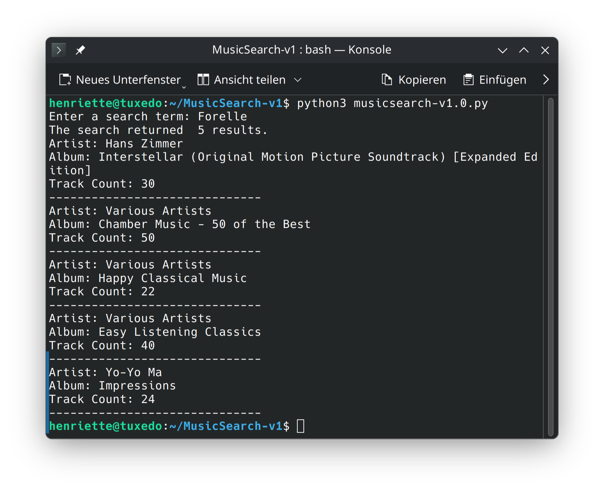
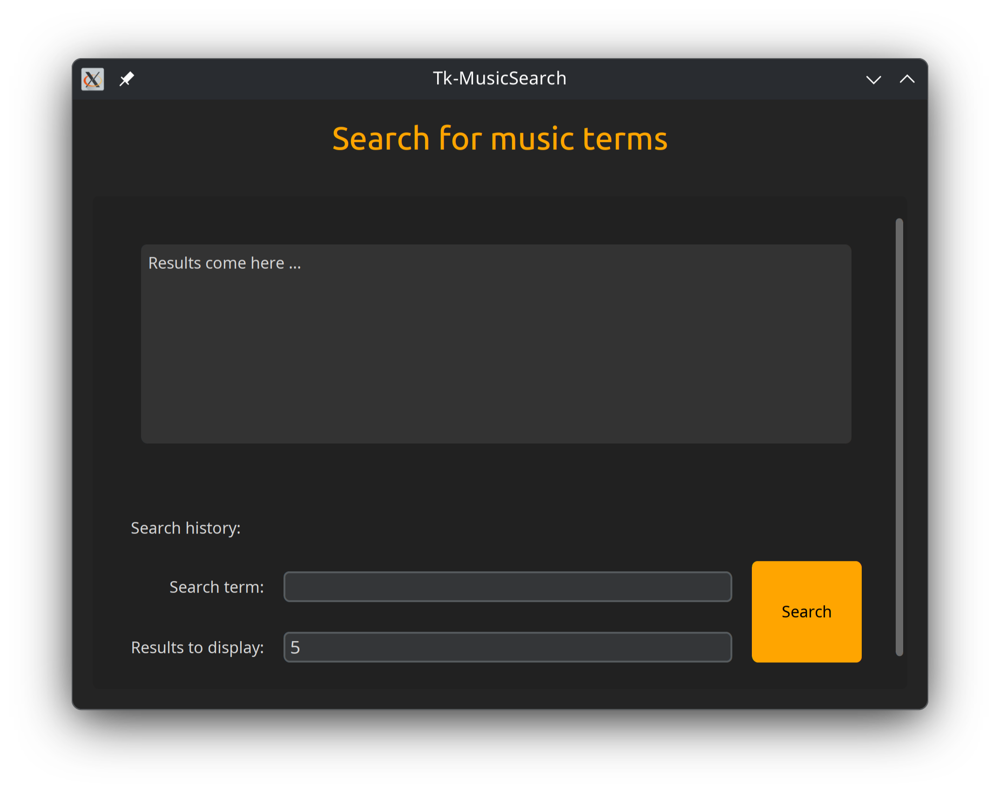

# MusicSearch v1

MusicSearch ist ein Lernprojekt in Python, das zeigt, wie man mit einer Suchanfrage Musikinformationen aus der iTunes-Datenbank abruft und darstellt – zuerst als Konsolen-Script und später mit einer grafischen Oberfläche (Tkinter). 


<table>
  <tr>
    <td>
      
    </td>
    <td>
      <h3> MusicSearch mit Python und Tkinter
    </td>
  </tr>
</table>


## Features

- Suche nach Musiktiteln und Interpreten über die **Apple iTunes API**
- Mehrere Versionen von 1.0 bis 1.5 mit wachsender Funktionalität
  - v1.0: Terminal-Suche
  - v1.1 – v1.4: GUI mit **Tkinter**
  - v1.5: Trennung von Logik und UI


 

  
## Voraussetzungen

Für dieses Projekt brauchsen Sie:

- Python ≥ 3.8
- Internetzugang (für API-Anfragen)
- Tkinter für die GUI-Versionen (in der Regel in Standard-Python-Installationen enthalten)


Eine kurze Einführung zu objektorientierter Programmierung mit Tkinter finden Sie im Verzeichnis:
`Documentation/tk-oop-basic`

## Installation
1. Klonen Sie das Repository:

   ```bash
   git clone https://github.com/henrietteBaum/MusicSearch-v1.gitone
   ```

2. Wechseln Sie in das Projektverzeichnis:

   ```bash
    cd MusicSearch-v1
    ```
3. (Optional) Erstellen Sie eine virtuelle Umgebung:
    ```bash
    python -m venv .venv
    source .venv/bin/activate  # Auf Windows: venv\Scripts\activate
    ```
4. Installieren Sie die Abhängigkeiten:
    ```bash
    pip install -r requirements.txt
    ```

## Nutzung
Für die Konsolen-Version (v1.0):
```bash
python musicsearch_v1_0.py
```

Für die GUI-Versionen (v1.1 bis v1.5):
```bash
python musicsearch_v1_5.py
```

## Projektstruktur

```
MusicSearch-v1/
├── Documentation/         # Erklärungen zu Python & Tkinter-OOP
├── musicsearch-v1.0.py
├── musicsearch-tk-v1.1.py
├── musicsearch-tk-v1.2.py
├── musicsearch-tk-v1.3.py
├── musicsearch-tk-v1.4.py
└── musicsearch-tk-project-v1.5/

```

## Beispielhafte API-Anfrage

Ein Beispiel, wie eine Anfrage an die iTunes API aussieht:

```python
import requests
def search_itunes(term):
    url = "https://itunes.apple.com/search"
    params = {"term": term, "media": "music", "limit": 5}
    response = requests.get(url, params=params)
    return response.json()
results = search_itunes("Forelle")
for item in results['results']:
    print(f"{item['trackName']} von {item['artistName']}")
```

## Erweiterungen
In zukünftigen Versionen könnten folgende Funktionen hinzugefügt werden:
- Nutzung weiterer APIs (z.B. MusicBrainz, Last.fm)
- Erweiterte Suchfilter (Genre, Veröffentlichungsjahr)
- Speicherung von Suchverläufen
- Verbesserte GUI-Elemente und Layouts

## Mitwirken 
Beiträge sind willkommen! Bitte öffnen Sie ein Issue oder einen Pull-Request, um Vorschläge zu machen oder Fehler zu melden.

## Lizenz
Dieses Projekt ist unter der MIT-Lizenz lizenziert. Weitere Informationen finden Sie in der Datei `LICENSE`.


